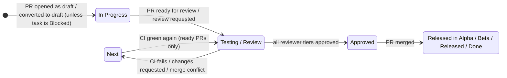

# GitHub → Asana PR state sync

Keeps the Asana tasks linked in a pull request description in step with the PR: it mirrors PR activity as Asana comments, moves tasks across board sections as the PR changes state, and manages review/CI **approval subtasks** for the reviewer teams.

A task is linked by putting its Asana URL anywhere in the PR description (both `https://app.asana.com/0/<project>/<task>` and `.../task/<task>` URL formats work). No linked task → the action is a no-op.

## The state machine

Only a PR that is **ready for review** can put a task in *Testing / Review*. A **draft** PR keeps its task in *In Progress*. *Blocked* is respected only by the draft rule — every real PR state change moves the task to track the PR.



| PR event | Task move | Notes |
| --- | --- | --- |
| Opened as draft / converted to draft | → In Progress | Skipped if the task sits in a Blocked or Released section. Convert-to-draft also deletes pending "Review" subtasks (the CI subtask survives). |
| Ready for review / review requested | → Testing / Review | Creates a pending "Review" approval subtask for the active reviewer tier. Draft PRs are ignored. |
| CI rejected (`comment-text: rejected`) | → Next | Pending review subtasks are deleted; the "Automated CI Testing" subtask records the verdict. Tasks in In Progress or Released sections stay put. |
| CI approved after a rejection | → Testing / Review | Only when the PR is not a draft; review subtasks are recreated. |
| Review: changes requested | → Next | Task is also reopened (marked incomplete). Tasks in In Progress or Released sections stay put. |
| Review: comment | *(no move)* | Comment reviews only mirror the comment to Asana. |
| Review: approved by all tiers | → Approved | Approval cascades PEER_DEV → DEV → QA; the next tier's subtasks are created as the previous tier finishes. Approvals on draft PRs, or from users missing from the user map, never promote. |
| Merged | → release section | `aaardvark-app` / `blinkmetrics-app`: `master` → *Released in Alpha*, `beta` → *Released in Beta*, `production` → *Released*. Every other repo: *Done*. Tasks are **never auto-completed**. |
| Merge-conflict comment from otto | → Next | Task reopened. |

Section names are matched per board; boards using "Blocked / Waiting" instead of "Blocked" (and similar variants) are both supported.

## Invocation modes

The same action runs in two modes, switched by `comment-text`:

1. **PR-activity sync** (any other `comment-text`, used by the fleet-wide `asana.yaml`): mirrors comments/reviews to Asana, adds followers, moves sections, manages review subtasks.
2. **CI-status sync** (`comment-text: approved | rejected | edit_pr_description`, used by the repos' CI pipelines): records the CI verdict on the "Automated CI Testing" subtask and moves the task; `edit_pr_description` instead injects the CI sandbox block into the PR description. CI-status runs never post PR comments.

## Inputs

| Input | Required | Purpose |
| --- | --- | --- |
| `asana-pat` | yes | Asana personal access token for all Asana calls. |
| `github-pat` | for reviews / description edits | Fetches PR reviews (approval cascade) and edits the PR body (`edit_pr_description`). |
| `comment-text` | no | Mode switch — see above. |
| `action-url` | CI mode | Link to the CI run, shown on the CI subtask. |
| `pr-description` | `edit_pr_description` mode | Sandbox block content. |
| `asana-secret` | no | Legacy, unused; kept so existing workflows don't warn. |

Supported triggers: `pull_request`, `pull_request_review`, `pull_request_review_comment`, `issue_comment`. For the draft rule to fire, the calling workflow must subscribe to the `converted_to_draft` pull_request type.

## People and teams

The GitHub↔Asana user map (with team tiers `PEER_DEV` / `DEV` / `QA` / `BOT`) lives in `src/constants/users.ts`. Unknown GitHub users are skipped safely: their comments still sync (as plain `@username` text), and they never crash the run.

## Developing

```bash
npm install       # husky installs the pre-commit hook (test + lint + package)
npm test          # jest — the state machine is covered in src/handlers/transitions.test.ts
npm run package   # rebuilds dist/ (committed; the runner executes dist/index.js)
```

Releases: consumer CI workflows pin `@main`; the fleet-wide managed `asana.yaml` (in the devops repo, `repo-commons/`) pins a tag. After merging behavior changes, cut a tag and bump the pin there.
