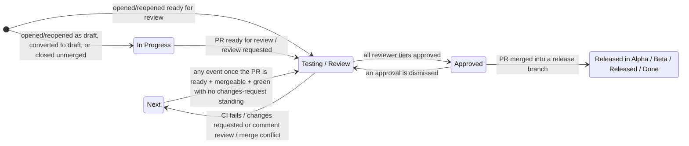

# GitHub → Asana PR state sync

Keeps the Asana tasks linked in a pull request description in step with the PR: it mirrors PR activity as Asana comments, moves tasks across board sections as the PR changes state, and manages review/CI **approval subtasks** for the reviewer teams.

A task is linked by putting its Asana URL anywhere in the PR description (both `https://app.asana.com/0/<project>/<task>` and `.../task/<task>` URL formats work). No linked task → the action is a no-op.

## The state machine

The task tracks whatever state the PR is in right now. A PR that is **ready for review** puts its task in *Testing / Review*; a **draft** PR, or one closed without merging, keeps its task in *In Progress*.

*Blocked* and the released columns are respected by the moves that park a task — the draft rule, an unmerged close, and every demotion. They are deliberately **not** respected when a PR goes ready for review: a PR up for review is a real state change, and the task follows it out of Blocked. A merge respects nothing and always moves the task.



| PR event | Task move | Notes |
| --- | --- | --- |
| Opened / reopened as draft, or converted to draft | → In Progress | Skipped if the task sits in a Blocked or Released section. Convert-to-draft also deletes pending "Review" subtasks (the CI subtask survives). |
| Opened / reopened ready for review, marked ready for review, or review requested | → Testing / Review | Creates a pending "Review" approval subtask for the active reviewer tier. Draft PRs are ignored. Marking a PR ready and requesting a reviewer land as two runs in the same second, and both may create the subtask; the newer duplicate is deleted right after, so each reviewer ends up with exactly one. Moves the task even out of Blocked — a PR up for review is a real state change. |
| CI rejected (`comment-text: rejected`) | → Next | Pending review subtasks are deleted; the "Automated CI Testing" subtask records the verdict. Tasks in In Progress or Released sections stay put. |
| CI approved after a rejection | → Testing / Review | Only when the PR is not a draft; review subtasks are recreated. |
| Review: changes requested | → Next | Task is also reopened (marked incomplete). Tasks in In Progress or Released sections stay put. |
| Review: comment | → Next | A "Comment" review from a reviewer in one of the three tiers is a rejection: they looked and did not approve. It takes the changes-requested path above, withdraws that reviewer's own earlier approval, and stands until the author re-requests them. A standalone reply in a thread also reaches GitHub as a comment review, but with no summary — that one, like a bot's or an unmapped user's comment review, only mirrors the comment to Asana. |
| Review: approved by all tiers | → Approved | Approval cascades PEER_DEV → DEV → QA; the next tier's subtasks are created as the previous tier finishes. Only the three human tiers gate this — approvals on draft PRs, from bots, or from users missing from the user map never promote on their own. **An approval is needed only once**: it stands until its reviewer changes their own verdict or the review is explicitly dismissed — a later changes-request from someone else (bots included) never invalidates it, mirroring GitHub's own semantics. A dismissed approval no longer counts, and the cascade **re-requests that reviewer on GitHub**, so the resulting `review_requested` event re-creates their "Review" subtask and nobody is left off the hook invisibly. A standing changes-request is never resummoned — the author answers it and re-requests by hand. A conflicting PR stops the cascade dead — no tier is handed a review and nothing is promoted, because resolving the conflict writes a diff nobody has reviewed; once resolved, standing approvals count again. GitHub computes mergeability asynchronously, so a PR whose state it has not answered for yet counts as mergeable. |
| Review: dismissed | → Testing / Review | A dismissed approval un-approves the PR, so the task cannot sit in Approved on a sign-off that no longer exists. Tasks in In Progress or Released sections stay put. |
| Merged | → release section | `aaardvark-app` / `blinkmetrics-app`: `master` → *Released in Alpha*, `beta` → *Released in Beta*, `production` → *Released*. Every other repo: *Done*. A merge into any other branch of a staged-release repo — a stacked PR — ships nothing and moves nothing. Tasks are **never auto-completed**, and a merge **never deletes approval subtasks** — they are the record of who signed off (and who never answered), and an approval given just before an auto-merge may not have reached its subtask yet. Instead, a still-open "Review" subtask is renamed **"FYI Review - merged to master"** (or `main` / `beta` / `production`) after the mainline branch it landed on, and **"FYI Review - merged to sub-PR"** for a merge into any other branch: nobody is waiting on it now the code is in, but the reviewer can still read it. A subtask that already carries a prefix (an earlier "FYI Review …", or any other "… Review") and one that has been answered are both left alone, so a repeated merge event changes nothing. A stacked merge relabels too — it ships nothing, but its reviews are just as finished. |
| Closed without merging | → In Progress | Pending "Review" subtasks are deleted; the task goes back to its author. Tasks in Blocked or Released sections stay put. |
| Review request removed | *(no move)* | That reviewer's pending "Review" subtask (the one the action created) is deleted; the re-check below decides who is active now. |
| Merge-conflict comment from otto | → Next | Task reopened; pending "Review" subtasks are deleted (the CI subtask survives). While the conflict stands the task cannot be promoted: see the approval row. Once it is resolved, the next event that reaches the action — otto's resolved comment, the green CI run, any review or comment — restores the subtasks and returns the task to Testing / Review (see the re-check below). |

### Every event re-checks the review state

The rows above each mirror one transition. After any of them runs, the action reads the PR fresh from GitHub and restates the whole review state. If the PR is open, ready for review, mergeable, its last CI verdict is not a rejection, and no changes-request (or tier reviewer's comment review) stands whose reviewer has not been re-requested, then:

- every reviewer of the active tier GitHub is still waiting on gets a pending "Review" subtask and the task moves to Testing / Review;
- once every tier has approved and GitHub waits on nobody, the task moves to Approved instead — including an approval given while the PR was conflicting, which counts as soon as the conflict is gone. An approver the author asks to review again keeps the tiers satisfied, but their fresh "Review" subtask stays pending and the task stays in Testing / Review until they answer;
- a pending "Review" subtask whose reviewer already approved on GitHub, and is not being asked again, is marked approved (a review that landed while its subtask was still being created);
- a reviewer whose approval was dismissed is re-requested on GitHub right away, not only when someone else approves later.

That is what makes Asana converge on the PR whatever order events arrive in — a conflict resolved, a webhook that never fired, two runs that overlapped. A task already in the right section is left where it is — Asana puts a moved task at the top of its section, so restating must never reshuffle the board. The re-check respects Blocked and the released columns, does nothing while GitHub has not computed mergeability yet, and skips CI-rejection and description-edit runs (the first has just parked the task on purpose, the second never touches Asana).

The same re-check runs as a **sweep** on a `schedule` or `workflow_dispatch` trigger: every open PR in the repo that links a task is restated in turn. One PR failing does not stop the rest; the run still ends red so the failure is visible. It is the safety net for a webhook that never fired at all.

Section names are matched per board; boards using "Blocked / Waiting" instead of "Blocked" (and similar variants) are both supported. A task in several projects is only moved when *none* of its sections is a protected one — a task parked in Blocked on one board is not quietly moved on another.

## Invocation modes

The same action runs in two modes, switched by `comment-text`:

1. **PR-activity sync** (any other `comment-text`, used by the fleet-wide `asana.yaml`): mirrors comments/reviews to Asana, adds followers, moves sections, manages review subtasks.
2. **CI-status sync** (`comment-text: approved | rejected | edit_pr_description`, used by the repos' CI pipelines): records the CI verdict on the "Automated CI Testing" subtask and moves the task; `edit_pr_description` instead injects the CI sandbox block into the PR description. CI-status runs never post PR comments.
3. **Sweep** (`schedule` / `workflow_dispatch` trigger, no `comment-text`): restates every open PR that links a task — see *Every event re-checks the review state*.

## Inputs

| Input | Required | Purpose |
| --- | --- | --- |
| `asana-pat` | yes | Asana personal access token for all Asana calls. |
| `github-pat` | yes | Reads the PR and its reviews on every event (the review re-check and the approval cascade), re-requests reviewers whose approval was dismissed, and edits the PR body (`edit_pr_description`). |
| `comment-text` | no | Mode switch — see above. |
| `action-url` | CI mode | Link to the CI run, shown on the CI subtask. |
| `pr-description` | `edit_pr_description` mode | Sandbox block content. |
| `asana-secret` | no | Legacy, unused; kept so existing workflows don't warn. |

Supported triggers: `pull_request`, `pull_request_review`, `pull_request_review_comment`, `issue_comment`, plus `schedule` and `workflow_dispatch` for the sweep. Three subscriptions the calling workflow has to get right:

- **`review_request_removed`** on `pull_request` — without it a reviewer taken off the PR keeps a pending approval in Asana forever.
- **`converted_to_draft`** on `pull_request` — without it the draft rule never fires.
- **`dismissed`** on `pull_request_review` — without it a dismissed approval leaves the task in Approved.

Do **not** subscribe to `pull_request: edited`. The CI-status mode patches the PR body itself, so the action would re-trigger on its own edits; `edited` is ignored on purpose.

## People and teams

The GitHub↔Asana user map lives in `src/constants/users.ts`. Only `PEER_DEV` / `DEV` / `QA` are **review tiers** — they are what the approval cascade gates on. `BOT` is not a tier: a bot's approval never promotes a task by itself, and a bot's pending or changes-requested review never blocks a human tier (its verdict is already tracked through the CI subtask and the changes-requested path). Unknown GitHub users are skipped safely: their comments still sync (as plain `@username` text), and they never crash the run.

## Developing

```bash
npm install       # husky installs the pre-commit hook (test + lint + package)
npm test          # jest — the state machine is covered in src/handlers/transitions.test.ts
npm run typecheck # tsc --noEmit
npm run package   # rebuilds dist/ (committed; the runner executes dist/index.js)
```

CI (`.github/workflows/ci.yml`) runs all of the above on every PR and fails if the committed `dist/` does not match a fresh build of `src/` — the runner executes `dist/index.js`, so a stale bundle ships behaviour that no longer matches the source.

Releases: consumer CI workflows pin `@main`; the fleet-wide managed `asana.yaml` (in the devops repo, `repo-commons/`) pins a tag. After merging behavior changes, cut a tag and bump the pin there.
