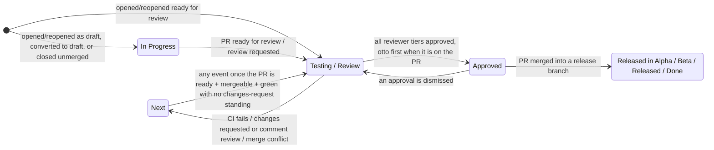

# GitHub → Asana PR state sync

Keeps the Asana tasks linked in a pull request description in step with the PR: it mirrors PR activity as Asana comments, moves tasks across board sections as the PR changes state, and manages review/CI **approval subtasks** for the reviewer teams.

A task is linked by putting its Asana URL anywhere in the PR description (both `https://app.asana.com/0/<project>/<task>` and `.../task/<task>` URL formats work). No linked task → the action is a no-op.

## The state machine

The task tracks whatever state the PR is in right now. A PR that is **ready for review** puts its task in *Testing / Review*; a **draft** PR, or one closed without merging, keeps its task in *In Progress*.

*Blocked* and the released columns are respected by the moves that park a task — the draft rule, an unmerged close, and every demotion. They are deliberately **not** respected when a PR goes ready for review: a PR up for review is a real state change, and the task follows it out of Blocked. A merge respects nothing and always moves the task.



| PR event | Task move | Notes |
| --- | --- | --- |
| Opened / reopened as draft, or converted to draft | → In Progress | Skipped if the task sits in a Blocked or Released section. Convert-to-draft also deletes pending "Review" subtasks (the CI subtask survives). |
| Opened / reopened ready for review, marked ready for review, or review requested | → Testing / Review | Creates a pending "Review" approval subtask for the active reviewer tier — named "Blocking Review" instead while its reviewer is the only one GitHub is still waiting on (see below), unless the PR is waiting on otto, in which case nobody is called yet (see *Otto reviews first* below). Draft PRs are ignored. Marking a PR ready and requesting a reviewer land as two runs in the same second, and both may create the subtask; the newer duplicate is deleted right after, so each reviewer ends up with exactly one. Moves the task even out of Blocked — a PR up for review is a real state change. |
| CI rejected (`comment-text: rejected`) | → Next | Pending review subtasks are deleted; the "Automated CI Testing" subtask records the verdict. Tasks in In Progress or Released sections stay put. |
| CI approved after a rejection | → Testing / Review | Only when the PR is not a draft; review subtasks are recreated. |
| Review: changes requested | → Next | Task is also reopened (marked incomplete). Tasks in In Progress or Released sections stay put. |
| Review: comment | → Next | A "Comment" review from a reviewer in one of the three tiers is a rejection: they looked and did not approve, whether they wrote a summary or only left notes on the diff. It takes the changes-requested path above, withdraws that reviewer's own earlier approval, and stands until the author re-requests them. GitHub also files a lone reply in an existing thread as a comment review; that one, the author's own notes on their diff, and a bot's or an unmapped user's comment review only mirror the comment to Asana — except otto's, which is also its answer on the PRs it is on (see *Otto reviews first* below). |
| Review: approved by all tiers | → Approved | Approval cascades PEER_DEV → DEV → QA — behind otto first, on a PR otto is on (see *Otto reviews first* below); the next tier's subtasks are created as the previous tier finishes. Only the three human tiers gate this — approvals on draft PRs, from bots, or from users missing from the user map never promote on their own. **An approval is needed only once**: it stands until its reviewer changes their own verdict or the review is explicitly dismissed — a later changes-request from someone else (bots included) never invalidates it, mirroring GitHub's own semantics. The run for an approval never hands the approver a second "Review": GitHub still lists them as requested at that moment, so only a real re-request — by a person, or by the dismissal below — asks them again. The two are told apart by GitHub's timeline, the one place a review request carries a time: a request that predates the approval is the stale listing, one that follows it is the author asking again, and that reviewer goes on being waited on instead of the task being promoted past them. A dismissed approval no longer counts, and the dismissal itself **re-requests that reviewer on GitHub** once, so the resulting `review_requested` event re-creates their "Review" subtask and nobody is left off the hook invisibly. A standing changes-request is never resummoned — the author answers it and re-requests by hand. A conflicting PR stops the cascade dead — no tier is handed a review and nothing is promoted, because resolving the conflict writes a diff nobody has reviewed; once resolved, standing approvals count again. GitHub computes mergeability asynchronously, so a PR whose state it has not answered for yet counts as mergeable. |
| Review: dismissed | → Testing / Review | A dismissed approval un-approves the PR, so the task cannot sit in Approved on a sign-off that no longer exists. The reviewer is re-requested on GitHub here and only here, unless someone already re-requested them by hand: GitHub reports every dismissed review the same way, so re-requesting from the review tally would summon them back on every event, even after the author took them off the PR. Tasks in In Progress or Released sections stay put. |
| Merged | → release section | `aaardvark-app` / `blinkmetrics-app`: `master` → *Released in Alpha*, `beta` → *Released in Beta*, `production` → *Released*. Every other repo: *Done*. A merge into any other branch of a staged-release repo — a stacked PR — ships nothing and moves nothing. Tasks are **never auto-completed**, and a merge **deletes no approval subtask but a reviewer's own duplicate** — they are the record of who signed off (and who never answered), and an approval given just before an auto-merge may not have reached its subtask yet. Instead, a still-open "Review" subtask is renamed **"FYI Review - merged to master"** (or `main` / `beta` / `production`) after the mainline branch it landed on, and **"FYI Review - merged to sub-PR"** for a merge into any other branch: nobody is waiting on it now the code is in, but the reviewer can still read it. A subtask that already carries a prefix (an earlier "FYI Review …", or any other "… Review") and one that has been answered are both left alone, so a repeated merge event changes nothing. A stacked merge relabels too — it ships nothing, but its reviews are just as finished. A reviewer on the active tier that the task carries **no** approval subtask for gets one **created** with the same label, so a review requested before the task was linked to the PR still reaches that reviewer's board. One who already has a subtask in any state — pending, answered, or the one this merge just relabelled — is never given a second, and a reviewer left holding two open reviews keeps the older one, the same converging rule the review rows follow. |
| Closed without merging | → In Progress | Pending "Review" subtasks are deleted; the task goes back to its author. Tasks in Blocked or Released sections stay put. |
| Merge-conflict comment from otto | → Next | Task reopened; pending "Review" subtasks are deleted (the CI subtask survives). While the conflict stands the task cannot be promoted: see the approval row. Once it is resolved, the next event that reaches the action — otto's resolved comment, the green CI run, any review or comment — restores the subtasks and returns the task to Testing / Review (see the re-check below). |

### Otto reviews first

On a PR otto is added to — GitHub lists it as a requested reviewer, or it has submitted a review — otto is the stage before the peer developers, so nobody is called to review a PR that may still need work. While otto is still to answer, because it is still requested or its standing verdict is anything but an approval (a changes-request, a dismissed approval), no human-tier "Review" subtask is created on any path, the cascade hands no tier a review, and the task is never moved to Approved. The task still moves to Testing / Review, and subtasks already handed out are left alone. Otto answers with an approval when it finds nothing new, a changes-request on a new Critical or High finding, and a comment-only report for anything in between. That report does not prove the earlier findings fixed, so it inherits a changes-request that stands; otherwise it counts as otto's approval.

Otto's approval, or the comment-only report that stands in for one, opens the stage on its own run, even while GitHub's reviewer list has not yet dropped it (the timeline tells that stale listing from a genuine re-request, as for a human approver), and the cascade continues PEER_DEV → DEV → QA from there. Asking otto again after it approved closes the stage until it answers. Dismissing otto's approval re-requests otto once, as for any reviewer (see the dismissed row); otherwise the author asks otto again by hand, once the PR is ready for another pass. A PR otto is not on runs PEER_DEV → DEV → QA exactly as before.

### Every event re-checks the review state

The rows above each mirror one transition. After any of them runs, the action reads the PR fresh from GitHub and restates the whole review state. If the PR is open, ready for review, mergeable, its last CI verdict is not a rejection, and no changes-request (or tier reviewer's comment review) stands whose reviewer has not been re-requested, then:

- every reviewer of the active tier GitHub is still waiting on gets a pending "Review" subtask and the task moves to Testing / Review — unless the PR is waiting on otto, in which case the task moves and nobody is called yet;
- once every tier has approved, GitHub waits on nobody and the PR is not waiting on otto, the task moves to Approved instead — including an approval given while the PR was conflicting, which counts as soon as the conflict is gone. An approver the author asks to review again keeps the tiers satisfied, but their fresh "Review" subtask stays pending and the task stays in Testing / Review until they answer;
- a pending "Review" subtask whose reviewer already approved on GitHub, and is not being asked again, is marked approved (a review that landed while its subtask was still being created).

That is what makes Asana converge on the PR whatever order events arrive in — a conflict resolved, a webhook that never fired, two runs that overlapped. A task already in the right section is left where it is — Asana puts a moved task at the top of its section, so restating must never reshuffle the board. The re-check leaves a task a person has completed alone, respects Blocked, Done and the released columns, does nothing while GitHub has not computed mergeability yet, and skips CI-rejection and description-edit runs (the first has just parked the task on purpose, the second never touches Asana).

Section names are matched per board; boards using "Blocked / Waiting" instead of "Blocked" (and similar variants) are both supported. A task in several projects is only moved when *none* of its sections is a protected one — a task parked in Blocked on one board is not quietly moved on another.

### The last reviewer left is told they are the last

A reviewer cannot tell from their own subtask whether the PR is waiting on them alone or on four other people as well, so the subtask says which: while its assignee is the only reviewer of the active tier GitHub is still waiting on it is named **"Blocking Review"**, and while others are outstanding alongside them every one is named **"Review"**.

The name follows GitHub's list of requested reviewers, not the subtasks on the task. GitHub announces reviewers one event at a time, so the subtasks of two reviewers requested together reach Asana in separate runs; counting subtasks would tell the first reviewer they are the last until the second one's subtask lands. GitHub's list holds both from the start, so each subtask is created under the name it keeps. Where the two disagree GitHub wins: a reviewer who only replied in a thread is off GitHub's list while their subtask is still pending, so theirs stays "Review" and does not stop the other reviewer's from reading "Blocking Review".

The name is restated each time the reviews change — whenever one is added or answered, and on the re-check after every event — rather than being set once and left. The list grows again as well as shrinks: a dismissed approval puts its reviewer back in the queue, and a subtask still claiming to be the last blocker would then be telling its assignee the PR waits on them alone when it does not. So a review whose assignee stops being the only one left is named back down to "Review".

Only those two names are ever touched. The "Automated CI Testing" subtask is never renamed, and neither is a subtask a merge has already relabelled "FYI Review …" — nobody is waiting on that one. A merge relabels a "Blocking Review" to its FYI name like any other open review.

## Invocation modes

The same action runs in two modes, switched by `comment-text`:

1. **PR-activity sync** (any other `comment-text`, used by the fleet-wide `asana.yaml`): mirrors comments/reviews to Asana, adds followers, moves sections, manages review subtasks.
2. **CI-status sync** (`comment-text: approved | rejected | edit_pr_description`, used by the repos' CI pipelines): records the CI verdict on the "Automated CI Testing" subtask and moves the task; `edit_pr_description` instead injects the CI sandbox block into the PR description. CI-status runs never post PR comments.

## Inputs

| Input | Required | Purpose |
| --- | --- | --- |
| `asana-pat` | yes | Asana personal access token for all Asana calls. |
| `github-pat` | yes | Reads the PR and its reviews on every event (the review re-check and the approval cascade), re-requests a reviewer whose review was dismissed, and edits the PR body (`edit_pr_description`). |
| `comment-text` | no | Mode switch — see above. |
| `action-url` | CI mode | Link to the CI run, shown on the CI subtask. |
| `pr-description` | `edit_pr_description` mode | Sandbox block content. |
| `asana-secret` | no | Legacy, unused; kept so existing workflows don't warn. |

Supported triggers: `pull_request`, `pull_request_review`, `pull_request_review_comment`, `issue_comment`. Two subscriptions the calling workflow has to get right:

- **`converted_to_draft`** on `pull_request` — without it the draft rule never fires.
- **`dismissed`** on `pull_request_review` — without it a dismissed approval leaves the task in Approved.

Do **not** subscribe to `pull_request: edited`. The CI-status mode patches the PR body itself, so the action would re-trigger on its own edits; `edited` is ignored on purpose.

## People and teams

The GitHub↔Asana user map lives in `src/constants/users.ts`. Only `PEER_DEV` / `DEV` / `QA` are **review tiers** — they are what the approval cascade gates on. `BOT` is not a tier: a bot's approval never promotes a task by itself. Otto is instead the stage *before* the tiers on the PRs it is added to (see *Otto reviews first*); its verdict is also tracked through the CI subtask and the changes-requested path. Unknown GitHub users are skipped safely: their comments still sync (as plain `@username` text), and they never crash the run.

## Developing

```bash
npm install       # husky installs the pre-commit hook (test + lint + package)
npm test          # jest — the state machine is covered in src/handlers/transitions.test.ts
npm run typecheck # tsc --noEmit
npm run package   # rebuilds dist/ (committed; the runner executes dist/index.js)
```

CI (`.github/workflows/ci.yml`) runs all of the above on every PR and fails if the committed `dist/` does not match a fresh build of `src/` — the runner executes `dist/index.js`, so a stale bundle ships behaviour that no longer matches the source.

Releases: consumer CI workflows pin `@main`; the fleet-wide managed `asana.yaml` (in the devops repo, `repo-commons/`) pins a tag. After merging behavior changes, cut a tag and bump the pin there.
