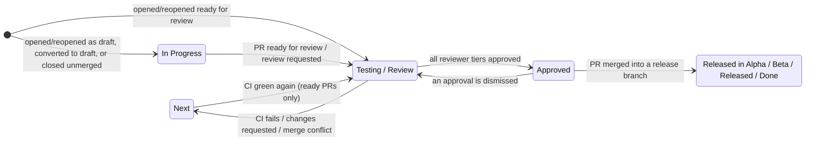

# GitHub → Asana PR state sync

Keeps the Asana tasks linked in a pull request description in step with the PR: it mirrors PR activity as Asana comments, moves tasks across board sections as the PR changes state, and manages review/CI **approval subtasks** for the reviewer teams.

A task is linked by putting its Asana URL anywhere in the PR description (both `https://app.asana.com/0/<project>/<task>` and `.../task/<task>` URL formats work). No linked task → the action is a no-op.

## The state machine

The task tracks whatever state the PR is in right now. A PR that is **ready for review** puts its task in *Testing / Review*; a **draft** PR, or one closed without merging, keeps its task in *In Progress*.

*Blocked* and the released columns are respected by the moves that park a task — the draft rule, an unmerged close, and every demotion. They are deliberately **not** respected when a PR goes ready for review: a PR up for review is a real state change, and the task follows it out of Blocked. A merge respects nothing and always moves the task.



| PR event | Task move | Notes |
| --- | --- | --- |
| Opened / reopened as draft, or converted to draft | → In Progress | Skipped if the task sits in a Blocked or Released section. Convert-to-draft also deletes pending "Review" subtasks (the CI subtask survives). |
| Opened / reopened ready for review, marked ready for review, or review requested | → Testing / Review | Creates a pending "Review" approval subtask for the active reviewer tier. Draft PRs are ignored. Moves the task even out of Blocked — a PR up for review is a real state change. |
| CI rejected (`comment-text: rejected`) | → Next | Pending review subtasks are deleted; the "Automated CI Testing" subtask records the verdict. Tasks in In Progress or Released sections stay put. |
| CI approved after a rejection | → Testing / Review | Only when the PR is not a draft; review subtasks are recreated. |
| Review: changes requested | → Next | Task is also reopened (marked incomplete). Tasks in In Progress or Released sections stay put. |
| Review: comment | *(no move)* | Comment reviews only mirror the comment to Asana. |
| Review: approved by all tiers | → Approved | Approval cascades PEER_DEV → DEV → QA; the next tier's subtasks are created as the previous tier finishes. Only the three human tiers gate this — approvals on draft PRs, from bots, or from users missing from the user map never promote on their own. An approval submitted before the newest standing changes-request is stale and no longer counts: its tier has to approve again. |
| Review: dismissed | → Testing / Review | A dismissed approval un-approves the PR, so the task cannot sit in Approved on a sign-off that no longer exists. Tasks in In Progress or Released sections stay put. |
| Merged | → release section | `aaardvark-app` / `blinkmetrics-app`: `master` → *Released in Alpha*, `beta` → *Released in Beta*, `production` → *Released*. Every other repo: *Done*. A merge into any other branch of a staged-release repo — a stacked PR — ships nothing and moves nothing. Tasks are **never auto-completed**, and a merge **never deletes approval subtasks** — they are the record of who signed off (and who never answered), and an approval given just before an auto-merge may not have reached its subtask yet. |
| Closed without merging | → In Progress | Pending "Review" subtasks are deleted; the task goes back to its author. Tasks in Blocked or Released sections stay put. |
| Merge-conflict comment from otto | → Next | Task reopened. |

Section names are matched per board; boards using "Blocked / Waiting" instead of "Blocked" (and similar variants) are both supported. A task in several projects is only moved when *none* of its sections is a protected one — a task parked in Blocked on one board is not quietly moved on another.

## Invocation modes

The same action runs in two modes, switched by `comment-text`:

1. **PR-activity sync** (any other `comment-text`, used by the fleet-wide `asana.yaml`): mirrors comments/reviews to Asana, adds followers, moves sections, manages review subtasks.
2. **CI-status sync** (`comment-text: approved | rejected | edit_pr_description`, used by the repos' CI pipelines): records the CI verdict on the "Automated CI Testing" subtask and moves the task; `edit_pr_description` instead injects the CI sandbox block into the PR description. CI-status runs never post PR comments.

## Inputs

| Input | Required | Purpose |
| --- | --- | --- |
| `asana-pat` | yes | Asana personal access token for all Asana calls. |
| `github-pat` | for reviews / description edits | Fetches PR reviews (approval cascade) and edits the PR body (`edit_pr_description`). |
| `comment-text` | no | Mode switch — see above. |
| `action-url` | CI mode | Link to the CI run, shown on the CI subtask. |
| `pr-description` | `edit_pr_description` mode | Sandbox block content. |
| `asana-secret` | no | Legacy, unused; kept so existing workflows don't warn. |

Supported triggers: `pull_request`, `pull_request_review`, `pull_request_review_comment`, `issue_comment`. Two subscriptions the calling workflow has to get right:

- **`converted_to_draft`** on `pull_request` — without it the draft rule never fires.
- **`dismissed`** on `pull_request_review` — without it a dismissed approval leaves the task in Approved.

Do **not** subscribe to `pull_request: edited`. The CI-status mode patches the PR body itself, so the action would re-trigger on its own edits; `edited` is ignored on purpose.

## People and teams

The GitHub↔Asana user map lives in `src/constants/users.ts`. Only `PEER_DEV` / `DEV` / `QA` are **review tiers** — they are what the approval cascade gates on. `BOT` is not a tier: a bot's approval never promotes a task by itself, and a bot's pending or changes-requested review never blocks a human tier (its verdict is already tracked through the CI subtask and the changes-requested path). Unknown GitHub users are skipped safely: their comments still sync (as plain `@username` text), and they never crash the run.

## Developing

```bash
npm install       # husky installs the pre-commit hook (test + lint + package)
npm test          # jest — the state machine is covered in src/handlers/transitions.test.ts
npm run typecheck # tsc --noEmit
npm run package   # rebuilds dist/ (committed; the runner executes dist/index.js)
```

CI (`.github/workflows/ci.yml`) runs all of the above on every PR and fails if the committed `dist/` does not match a fresh build of `src/` — the runner executes `dist/index.js`, so a stale bundle ships behaviour that no longer matches the source.

Releases: consumer CI workflows pin `@main`; the fleet-wide managed `asana.yaml` (in the devops repo, `repo-commons/`) pins a tag. After merging behavior changes, cut a tag and bump the pin there.
